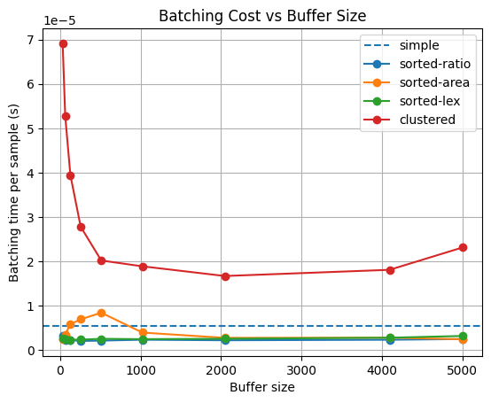
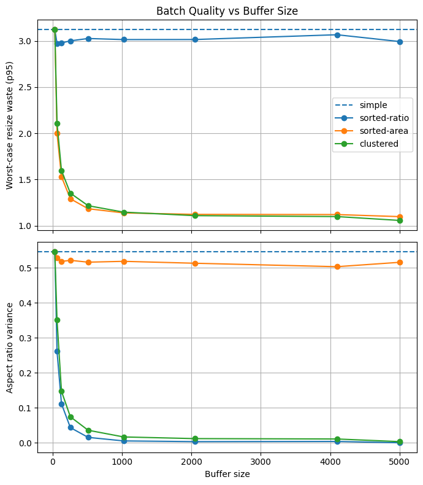

# mm-tokenize-batcher

Smart batching strategies for variable-resolution images in multimodal pipelines.

## Problem

Multimodal models process images at varying native resolutions, but batched inference requires uniform tensor shapes within each batch. Naive batching groups images arbitrarily and resizes them to a common size, wasting compute on padding or distortion — especially when a batch mixes tall, wide, and square images.

## Strategies

All batchers operate on a **buffer** of samples (each containing a PIL image and optional text) and return logical batches with a computed `resize_size`:

- **SimpleBatcher** — Groups contiguous samples in order. Fast but wasteful when image sizes vary widely.
- **SortedBatcher** — Sorts images by aspect ratio (or area, or a custom key) before grouping, so similarly-shaped images land in the same batch. Larger buffers yield better groupings.
- **ClusteredBatcher** — Runs k-means on (aspect ratio, log area) features to form clusters, then splits clusters into batches. Produces the tightest groupings at the cost of a small clustering overhead.

## Usage

```python
from mm_tokenize_batcher import SimpleBatcher, SortedBatcher, ClusteredBatcher

# Each sample is a dict with an "image" key (PIL Image) and optional "text"
buffer = [{"image": img} for img in images]

batcher = ClusteredBatcher(batch_size=32)
batches = batcher(buffer)

for batch in batches:
    imgs = batch["images"]        # List[PIL.Image]
    h, w = batch["resize_size"]   # Target size for this batch
    # resize and tokenize ...
```

## Benchmark Results

Evaluated on 5,000 synthetic images with random resolutions (224-1024px per side), batch size 32.

**Batching cost** — ClusteredBatcher has higher per-sample overhead than sorting, but both are negligible compared to actual model inference:



**Batch quality** — Sorted and clustered strategies dramatically reduce within-batch aspect ratio variance. ClusteredBatcher achieves the best p95 resize waste (near 1.0x) by jointly optimizing for both aspect ratio and area:



## Dependencies

- `numpy`
- `torch`
- `Pillow`
- `fastkmeans`
